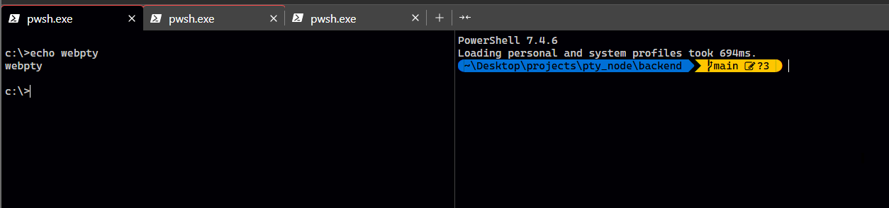

# WebPTY

A web-based terminal emulator that allows you to run commands in a terminal-like interface.



To build and run the demo using docker, follow these commands:

```bash
docker build . -t webpty
docker run -p 8900:8900 --rm webpty
```

## Features

- **Tab Menu**: Multiple terminal sessions with a tab interface.
- **Split Terminals**: Split terminals horizontally or vertically in the same tab.
- **Keyboard Shortcuts**: keyboard shortcuts for various terminal actions.

## Architecture

- **Backend**: `node.js`, `express`, `node-pty`
- **Frontend**: `svelte`, `xterm.js`

## Installation

### Prerequisites

Ensure you have the following installed:

- `nvm` with the following versinos:
  - `v16.16.0` for backend
  - `latest version` for frontend

### Steps

1. Clone the repository:

   ```bash
   git clone https://github.com/4jairo/WebPTY.git
   cd WebPTY
   ```

2. Install dependencies:

    ```bash
    cd frontend
    npm install

    cd ../backend
    npm install
    ```

3. Build frontend

    ```bash
    cd frontend
    nvm use latest
    npm run build
    ```

4. Build backend

    The final binary executables will be in the `dist/bin` directory

    ```bash
    cd ../backend

    nvm use v16.16.0 # in windows systems will change on every terminal
    #or
    ./scripts/setNodeVersion.<ext> # only on current terminal

    npm run build
    ```

## Usage

1. Open your browser and navigate to `http://localhost:<port> (default 8900)`.
2. Start a new terminal session from the tab menu.
3. Select your preferred shell from the tab context menu or use the default one.

## Development

To run the backend in development mode with live reload:

```bash
cd backend

nvm use v16.16.0 # in windows systems will change on every terminal
#or
./scripts/setNodeVersion.<ext> # only on current terminal

npm run dev
```

To run the frontend in development mode:

```bash
cd frontend
nvm use latest
npm run dev
```
